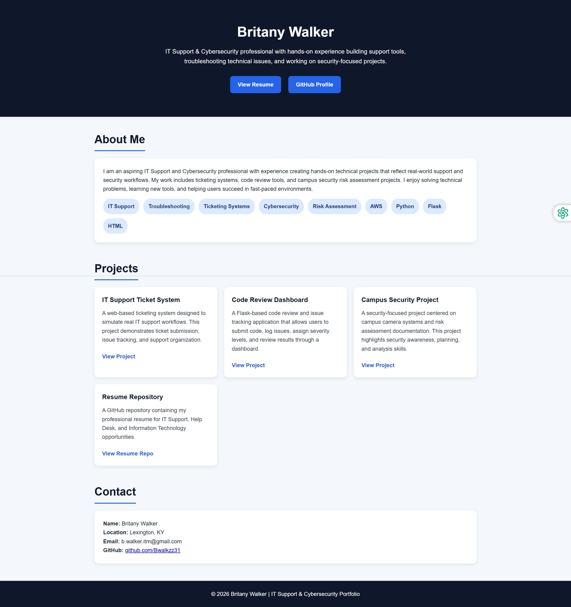

# IT Help Desk Ticket System

A web-based IT support ticketing system built with Flask, SQLite, and HTML/CSS.

## Features
- Submit support tickets
- Assign priority levels (Low, Medium, High)
- Mark tickets as resolved
- Dashboard showing:
  - Total tickets
  - Open tickets
  - Resolved tickets

## Technologies Used
- Python (Flask)
- SQLite
- HTML/CSS

## How to Run Locally

1. Clone the repository:
git clone https://github.com/Bwalkzz31/it-ticket-system.git

2. Navigate into the project:
cd it-ticket-system

3. Install dependencies:
pip install flask

4. Run the application:
python app.py

5. Open in browser:
http://127.0.0.1:5000

## Project Purpose
This project demonstrates IT support workflows, ticket management, and basic system troubleshooting concepts.

## Screenshot

